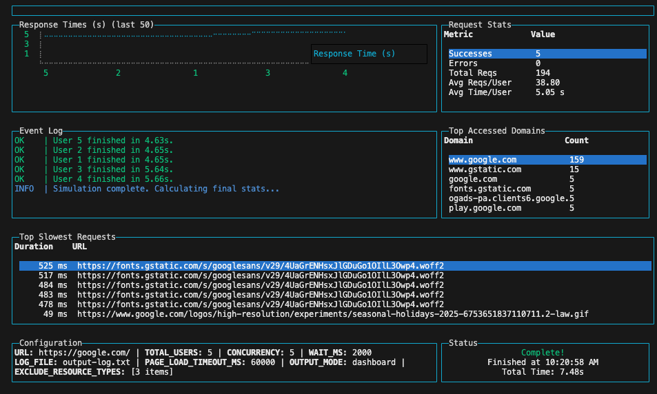

# 👻 GhostWebSurfer

**A powerful browser automation tool for load testing and performance analysis**

GhostWebSurfer simulates multiple concurrent users accessing websites using real browser instances (Playwright). Unlike simple HTTP clients, it executes JavaScript, follows redirects, loads all resources, and captures detailed performance metrics just like real users browsing your site.

[](https://opensource.org/licenses/ISC)
[](https://nodejs.org/)
[](https://playwright.dev/)
[](http://makeapullrequest.com)

---

## 📸 Screenshots

### Dashboard Mode
The interactive terminal dashboard provides real-time metrics and visualizations:
- **Response Time Chart**: Tracks load times for each simulated user
- **Request Statistics**: Live stats including success rate and average response times
- **Event Log**: Real-time log of all simulation events
- **Top Domains**: Most frequently accessed domains
- **Slowest Requests**: Performance bottlenecks identified automatically

### File Mode
Generates comprehensive logs with:
- Individual user session details
- All network requests sorted by duration
- Performance summary with aggregated statistics
- Top slowest requests and most accessed domains

---

## ✨ Features

- 🌐 **Real Browser Simulation** - Uses Playwright to load pages with full JavaScript execution
- 📊 **Interactive Dashboard** - Beautiful terminal UI with real-time metrics and statistics
- 🎯 **Concurrent User Simulation** - Control the number of simultaneous users with configurable concurrency
- 📈 **Performance Metrics** - Captures response times for all network requests
- 🔍 **Resource Analysis** - Identifies slowest requests and most accessed domains
- 📝 **Detailed Logging** - Comprehensive logs of all requests and their performance
- ⚙️ **Flexible Configuration** - Configure via config file or environment variables
- 🚀 **Easy Setup** - Makefile handles all dependencies automatically

---

## 📋 What It Does

- ✅ Accesses target URLs with a real browser engine (Chromium)
- ✅ Executes all JavaScript just like Chrome would
- ✅ Captures **all network requests** made during page load
- ✅ Measures individual request durations and total load times
- ✅ Simulates concurrent users with configurable limits
- ✅ Provides real-time progress visualization
- ✅ Generates detailed performance reports
- ✅ Identifies performance bottlenecks and slow resources

---

## 🚀 Quick Start

### Prerequisites

**Choose one of the following methods:**

#### Option 1: Docker (Recommended)

- **Docker**: Version 20.10+
- **Docker Compose**: Version 2.0+
- No other dependencies needed!

#### Option 2: Local Installation

- **macOS**: Homebrew (will be used to install Node.js if needed)
- **Linux**: apt-get (for Debian/Ubuntu)
- **Node.js**: Version 16 or higher (will be installed automatically if missing)

---

### 🐳 Running with Docker (Easiest)

Docker is the **recommended** way to run GhostWebSurfer as it handles all dependencies automatically.

> 📚 **For detailed Docker documentation, see [DOCKER.md](DOCKER.md)**

#### Quick Start with Docker

```bash
# Clone the repository
git clone <your-repo-url>
cd GhostWebSurfer

# Build and run with Docker Compose
make docker-run

# Or build and run dashboard mode
make docker-dashboard

# Or use docker-compose directly
docker-compose up
```

#### Docker Compose Examples

```bash
# Run with environment variables
TARGET_URL=https://example.com TOTAL_USERS=10 docker-compose up

# Run in dashboard mode
docker-compose --profile dashboard up ghostwebsurfer-dashboard

# Run with custom .env file
cp .env.docker .env
# Edit .env with your settings
docker-compose --env-file .env up

# Run in detached mode (background)
docker-compose up -d

# View logs
docker-compose logs -f

# Stop and remove containers
docker-compose down
```

#### Docker Run Examples

```bash
# Run directly with docker run
docker run --rm \
  --security-opt seccomp=unconfined \
  --shm-size=2gb \
  -e TARGET_URL=https://example.com \
  -e TOTAL_USERS=10 \
  -e CONCURRENCY=5 \
  -v $(pwd)/output:/app/output \
  ghostwebsurfer:latest

# Dashboard mode (interactive)
docker run --rm -it \
  --security-opt seccomp=unconfined \
  --shm-size=2gb \
  -e TARGET_URL=https://example.com \
  -e OUTPUT_MODE=dashboard \
  ghostwebsurfer:latest
```

#### Docker Helper Script

The `docker-run.sh` script provides a convenient way to run simulations:

```bash
# Basic usage
./docker-run.sh -u https://example.com -n 10

# With dashboard mode
./docker-run.sh -d -u https://example.com

# Custom output directory
./docker-run.sh -u https://example.com -o ./my-results

# Full options
./docker-run.sh -u https://example.com -n 20 -c 5 -o ./results

# View help
./docker-run.sh --help
```

---

### Installation & Running (Local)

The easiest way to run GhostWebSurfer is using the provided Makefile:

```bash
# Clone the repository
git clone <your-repo-url>
cd GhostWebSurfer

# Run with file logging (default)
make run

# Run with interactive dashboard
make dashboard
```

The Makefile will automatically:
1. Check for Node.js and install it if missing
2. Install all npm dependencies
3. Install Playwright browsers
4. Run the simulation

### Manual Installation

If you prefer to install dependencies manually:

```bash
# Install dependencies
npm install

# Install Playwright browsers
npx playwright install

# Run the script
node simulate-users.js

# Or with dashboard mode
OUTPUT_MODE=dashboard node simulate-users.js
```

---

## ⚙️ Configuration

Configure the simulation by editing [`config.js`](config.js) or using environment variables:

### Using Environment Variables

Copy the example file and modify as needed:
```bash
cp .env.example .env
# Edit .env with your preferred settings
```

### Configuration Options

| Variable | Default | Description |
|----------|---------|-------------|
| `TARGET_URL` | `https://google.com/` | URL to test |
| `TOTAL_USERS` | `5` | Total number of users to simulate |
| `CONCURRENCY` | `5` | Maximum concurrent users |
| `WAIT_MS` | `2000` | Additional wait time after page load (ms) |
| `LOG_FILE` | `output-log.txt` | Output log file name |
| `PAGE_LOAD_TIMEOUT_MS` | `60000` | Page load timeout in milliseconds |
| `OUTPUT_MODE` | `file` | Output mode: `file` or `dashboard` |
| `EXCLUDE_RESOURCE_TYPES` | `['xhr', 'fetch', 'other']` | Resource types to exclude from analysis |

### Examples

```bash
# Test a different URL with 10 concurrent users
TARGET_URL=https://example.com TOTAL_USERS=10 make run

# Run with dashboard and custom concurrency
CONCURRENCY=3 make dashboard

# Change log file name
LOG_FILE=my-test-results.txt make run
```

---

## 📊 Output Modes

### File Mode (Default)

Generates a detailed log file with:
- Individual user results with load times
- All captured requests sorted by duration
- Overall simulation summary
- Top 10 slowest requests
- Top 10 most accessed domains

```bash
make run
# or
node simulate-users.js
```

### Dashboard Mode

Displays an interactive terminal dashboard with:
- Real-time response time chart
- Live request statistics
- Event log
- Top accessed domains
- Slowest requests table
- Configuration summary

```bash
make dashboard
# or
OUTPUT_MODE=dashboard node simulate-users.js
```



Press `q` or `Esc` to exit the dashboard.

---

## 📁 Project Structure

```
GhostWebSurfer/
├── simulate-users.js       # Main entry point
├── simulator.js            # User simulation logic
├── config.js              # Configuration settings
├── logger.js              # File logging handler
├── dashboard.js           # Interactive dashboard UI
├── analysis.js            # Statistics collection
├── package.json           # Node.js dependencies
├── Makefile              # Build and run automation
├── Dockerfile            # Docker container definition
├── docker-compose.yml    # Docker Compose configuration
├── docker-run.sh         # Docker helper script
├── .dockerignore         # Docker ignore patterns
├── .env.example          # Environment variables template
├── .env.docker           # Docker environment template
└── README.md             # This file
```

---

## 🎯 Use Cases

- **Load Testing**: Simulate realistic user traffic to test server capacity
- **Performance Analysis**: Identify slow resources and bottlenecks
- **SEO Auditing**: Verify page load times and resource loading
- **CI/CD Integration**: Automate performance testing in your pipeline
- **Web Development**: Monitor how code changes affect page performance

---

## 📈 Sample Output

### File Mode Log
```
--- User 1 ---
URL: https://example.com
Total Load Time: 2.451s
Captured Requests (47):
  - [1.234s] https://example.com/main.js
  - [0.987s] https://cdn.example.com/image.png
  ...

--- Simulation Summary ---
Total Duration: 15.32s
Overall Stats:
  - Successes      : 5
  - Errors         : 0
  - Total Requests : 235
  - Avg Reqs/User  : 47.0
  - Avg Time/User  : 2.45s
```

---

## 🛠️ Troubleshooting

### Playwright Installation Issues
```bash
# Manually install Playwright browsers
npx playwright install --with-deps
```

### Node.js Version Issues
Make sure you're using Node.js 16 or higher:
```bash
node --version
```

### Permission Issues (Linux)
Some systems may require sudo for browser installation:
```bash
sudo npx playwright install --with-deps
```

### Timeout Errors
If pages are timing out, increase the timeout:
```bash
PAGE_LOAD_TIMEOUT_MS=120000 make run
```

### High Memory Usage
Reduce concurrency if you experience memory issues:
```bash
CONCURRENCY=2 make run
```

### Docker Issues

**Chromium crashes in Docker:**
```bash
# Increase shared memory
docker run --shm-size=2gb ...

# Or use host IPC
docker run --ipc=host ...
```

**Permission issues with output directory:**
```bash
# Ensure output directory exists and is writable
mkdir -p ./output
chmod 777 ./output
```

**Container exits immediately:**
```bash
# Check logs
docker-compose logs

# Run interactively to see errors
docker run --rm -it ghostwebsurfer:latest
```

---

## ❓ FAQ

**Q: What's the difference between GhostWebSurfer and other load testing tools?**  
A: GhostWebSurfer uses real browsers (via Playwright) instead of simple HTTP clients. This means it executes JavaScript, loads all resources, and behaves exactly like real users, providing more accurate performance metrics.

**Q: Can I run this in CI/CD pipelines?**  
A: Yes! GhostWebSurfer works great in CI/CD environments. The Docker image is perfect for CI/CD as it includes all dependencies. Use the file output mode and check the logs for performance regressions.

**Q: Why Docker instead of npm install?**  
A: Docker provides a consistent environment with all Playwright dependencies pre-installed, eliminating "works on my machine" issues. It's especially useful in CI/CD pipelines and when running on different operating systems.

**Q: How do I test authenticated pages?**  
A: You can modify the `simulator.js` file to add authentication logic before navigating to the target URL. Check the Playwright documentation for authentication examples.

**Q: Does it work with single-page applications (SPAs)?**  
A: Absolutely! Since it uses a real browser, it handles SPAs, React, Vue, Angular, and any other framework that relies on JavaScript.

**Q: Can I use this for production load testing?**  
A: While GhostWebSurfer is great for performance analysis and moderate load testing, consider dedicated load testing tools (like k6 or Artillery) for high-volume production load tests.

---

## 🧹 Cleanup

Remove all generated files and dependencies:
```bash
make clean
```

---

## �️ Tech Stack

- **[Node.js](https://nodejs.org/)** - JavaScript runtime
- **[Playwright](https://playwright.dev/)** - Browser automation framework
- **[blessed](https://github.com/chjj/blessed)** - Terminal UI library for interactive dashboard
- **[blessed-contrib](https://github.com/yaronn/blessed-contrib)** - Terminal charts and widgets
- **[cli-progress](https://github.com/npkgz/cli-progress)** - Elegant progress bars
- **[p-limit](https://github.com/sindresorhus/p-limit)** - Concurrency control

---

## �📝 License

ISC License - See [LICENSE](LICENSE) file for details

---

## 🤝 Contributing

Contributions are welcome! Please feel free to submit issues or pull requests.

---

## 🔗 Related Projects

- [Playwright](https://playwright.dev/) - Browser automation framework
- [blessed](https://github.com/chjj/blessed) - Terminal UI library
- [cli-progress](https://github.com/npkgz/cli-progress) - Progress bar library

---

**Made with ❤️ for performance testing and web analysis**
